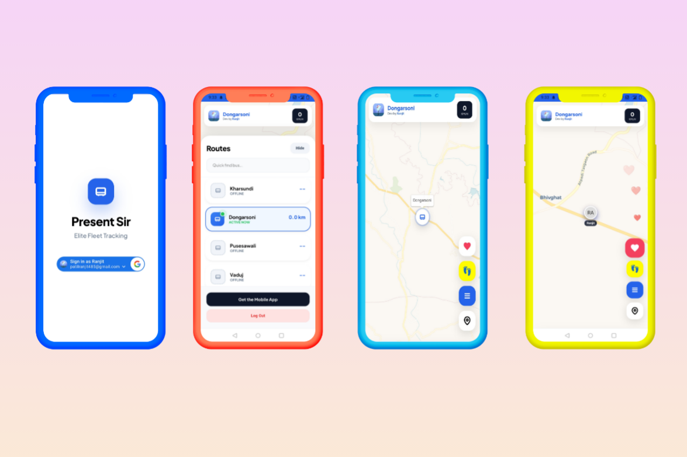
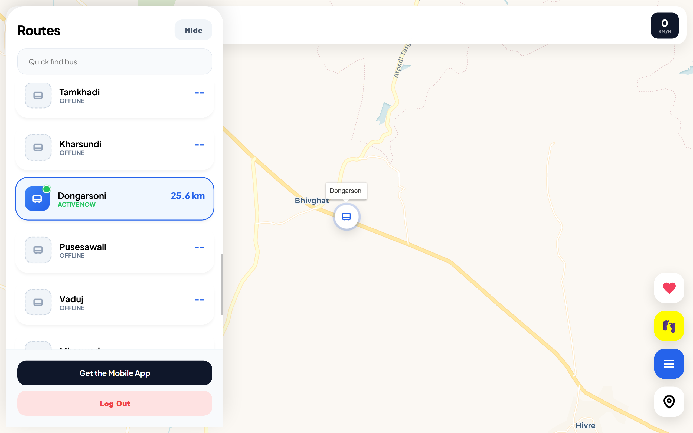

# 🚍 PresentSir  
## Distributed Real-Time Fleet Telemetry Platform


---

PresentSir is a real-time fleet monitoring system that synchronizes Android edge devices with a live web dashboard using secure REST APIs and WebSocket streaming.

Designed to demonstrate distributed systems thinking, mobile background reliability, and production-grade cloud deployment.

---

## 🌍 Live System

| Component | URL | Repository |
|------------|------|------------|
| Web Dashboard (PWA) | https://ait-runner.pages.dev | https://github.com/PresentSir-Fleet-Monitoring/presentsir-web-dashboard |
| Backend API | https://presentsir-server.onrender.com | https://github.com/PresentSir-Fleet-Monitoring/presentsir-backend-api |
| Android Client | APK Available | https://github.com/PresentSir-Fleet-Monitoring/presentsir-mobile-client-android |
| Landing Page | — | https://github.com/PresentSir-Fleet-Monitoring/presentsir-landing-page |
| Postman Collection | API Testing | https://gold-sunset-580688.postman.co/workspace/Present-Sir~ffeb7cb3-bc68-4ca7-afbf-095eaa8d385d/request/25069061-c9344cc6-62af-43b0-9309-4e985e6cd71e?tab=body |
| Docker Image | ranjit485/presentsir-server | https://hub.docker.com/repository/docker/ranjit485/presentsir-server |

---

## 🏗 Architecture

```
                ┌────────────────────────┐
                │     Android Client     │
                │  REST + WebSocket      │
                └────────────┬───────────┘
                             │
                             │ HTTPS (JWT)
                             │ WebSocket (STOMP)
                             ▼
                ┌────────────────────────┐
                │      Spring Boot       │
                │  REST API + WS Broker  │
                └────────────┬───────────┘
                             │
                             │ WebSocket (STOMP)
                             ▼
                ┌────────────────────────┐
                │       PWA Client       │
                │  REST + WebSocket      │
                └────────────────────────┘

```

---

## 🔧 Tech Stack

### Backend
- Spring Boot
- REST APIs
- WebSocket (STOMP)
- JWT Authentication
- Google OAuth 2.0
- OneSignal Push Notifications
- Dockerized deployment
- Hosted on Render

### Mobile (Android – Java)
- Foreground service for background resilience
- Fused Location Provider
- Battery-aware polling
- Secure token-based communication

### Web (PWA)
- HTML / CSS / JavaScript
- WebSocket real-time updates
- Installable PWA
- Cloudflare edge delivery
- Google OAuth integration

---

## 🔐 Security

- Stateless JWT authentication
- Google OAuth login
- Role-Based Access Control (RBAC)
- Secured REST endpoints
- Authenticated WebSocket sessions

---

## 📸 Screenshots

### 🖥 Web Dashboard

**PWA View**  


**Desktop View**  


---

### 📱 Android Application

**Active GPS Tracking**  


---

## 🐳 Docker Deployment

Docker Hub:

https://hub.docker.com/repository/docker/ranjit485/presentsir-server

Run locally:

```bash
docker pull ranjit485/presentsir-server:latest
docker run -p 8080:8080 ranjit485/presentsir-server
```

---

## 📬 API Testing

Postman Collection:  
https://gold-sunset-580688.postman.co/workspace/Present-Sir~ffeb7cb3-bc68-4ca7-afbf-095eaa8d385d/request/25069061-c9344cc6-62af-43b0-9309-4e985e6cd71e?tab=body

Includes:
- Authentication APIs
- Telemetry ingestion
- Admin routes
- Health check endpoints

---

## 👨‍💻 Author

Ranjit  
Java • Spring Boot • Distributed Systems • Android
