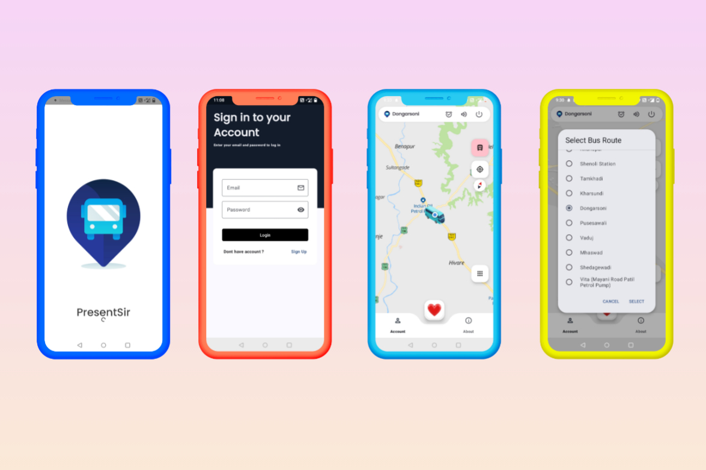

# 🚍 PresentSir 

[](https://ait-runner.pages.dev/)

**View Live :** https://ait-runner.pages.dev/

## Distributed Real-Time Fleet Telemetry Platform


---

PresentSir is a real-time fleet monitoring system that synchronizes Android edge devices with a live web dashboard using secure REST APIs and WebSocket streaming.

Designed to demonstrate distributed systems thinking, mobile background reliability, and production-grade cloud deployment.

---

## 🌍 Live System
| Resource                   | Link                                                                                 | Description                                           | GitHub Repository                                                                                                   |
| :------------------------- | :----------------------------------------------------------------------------------- | :---------------------------------------------------- | :------------------------------------------------------------------------------------------------------------------ |
| **🌐 Web Dashboard (PWA)** | [ait-runner.pages.dev](https://ait-runner.pages.dev)                                 | Live Fleet Monitoring (Cloudflare Edge Deployment)    | [presentsir-web-dashboard](https://github.com/PresentSir-Fleet-Monitoring/presentsir-web-dashboard)                 |
| **📲 Android App**         | APK Available (v1.0)                                                                 | GPS Telemetry Client (Foreground Service + WebSocket) | [presentsir-mobile-client-android](https://github.com/PresentSir-Fleet-Monitoring/presentsir-mobile-client-android) |
| **📡 Backend API**         | [presentsir-server.onrender.com](https://presentsir-server.onrender.com)             | Spring Boot REST + WebSocket Broker (Render)          | [presentsir-backend-api](https://github.com/PresentSir-Fleet-Monitoring/presentsir-backend-api)                     |
| **❤️ Server Health**       | [API Status Check](https://presentsir-server.onrender.com/ps/api/public/goodmorning) | Real-time Backend Heartbeat Endpoint                  | [presentsir-backend-api](https://github.com/PresentSir-Fleet-Monitoring/presentsir-backend-api)                     |
| **🏠 Landing Page**        | Official Site (Coming Soon)                                                          | Project Overview & Marketing                          | [presentsir-landing-page](https://github.com/PresentSir-Fleet-Monitoring/presentsir-landing-page)                   |
| **📬 Postman Collection**  | API Testing Workspace                                                                | Authentication & Telemetry APIs                       | Postman Workspace                                                                                                   |
| **🐳 Docker Image**        | ranjit485/presentsir-server                                                          | Production Container Image                            | Docker Hub                                                                                                          |

---

## 🏗 Architecture

```
                ┌────────────────────────┐
                │     Android Client     │
                │  REST + WebSocket      │
                └────────────┬───────────┘
                             │
                             │ HTTPS (JWT)
                             │ WebSocket (STOMP)
                             ▼
                ┌────────────────────────┐
                │      Spring Boot       │
                │  REST API + WS Broker  │
                └────────────┬───────────┘
                             │
                             │ WebSocket (STOMP)
                             ▼
                ┌────────────────────────┐
                │       PWA Client       │
                │  REST + WebSocket      │
                └────────────────────────┘

```

---

## 🔧 Tech Stack

### Backend
- Spring Boot
- REST APIs
- WebSocket (STOMP)
- JWT Authentication
- Google OAuth 2.0
- OneSignal Push Notifications
- Dockerized deployment
- Hosted on Render

### Mobile (Android – Java)
- Foreground service for background resilience
- Fused Location Provider
- Battery-aware polling
- Secure token-based communication
- Download Apk : https://github.com/PresentSir-Fleet-Monitoring/presentsir-mobile-client-android/releases

### Web (PWA)
- HTML / CSS / JavaScript
- WebSocket real-time updates
- Installable PWA
- Cloudflare edge delivery
- Google OAuth integration

---

## 🔐 Security

- Stateless JWT authentication
- Google OAuth login
- Role-Based Access Control (RBAC)
- Secured REST endpoints
- Authenticated WebSocket sessions

---

## 📸 Screenshots

### 🖥 Web Dashboard

**PWA View**  


**Desktop View**  


---

### 📱 Android Application

**Active GPS Tracking**  


---

## 🐳 Docker Deployment

Docker Hub:

https://hub.docker.com/repository/docker/ranjit485/presentsir-server

Run locally:

```bash
docker pull ranjit485/presentsir-server:latest
docker run -p 8080:8080 ranjit485/presentsir-server
```

---

## 📬 API Testing

Postman Collection:  
https://gold-sunset-580688.postman.co/workspace/Present-Sir~ffeb7cb3-bc68-4ca7-afbf-095eaa8d385d/request/25069061-c9344cc6-62af-43b0-9309-4e985e6cd71e?tab=body

Includes:
- Authentication APIs
- Telemetry ingestion
- Admin routes
- Health check endpoints

---

## 👨‍💻 Author

Ranjit  
Java • Spring Boot • Distributed Systems • Android

